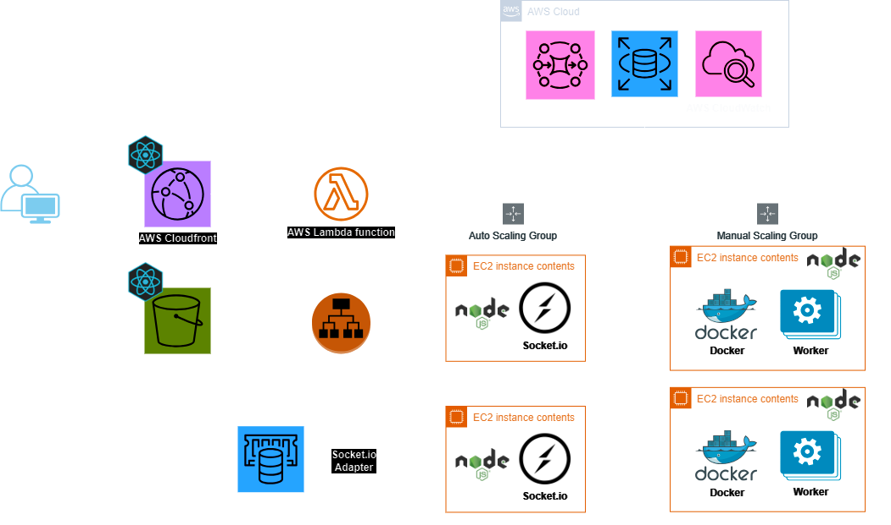
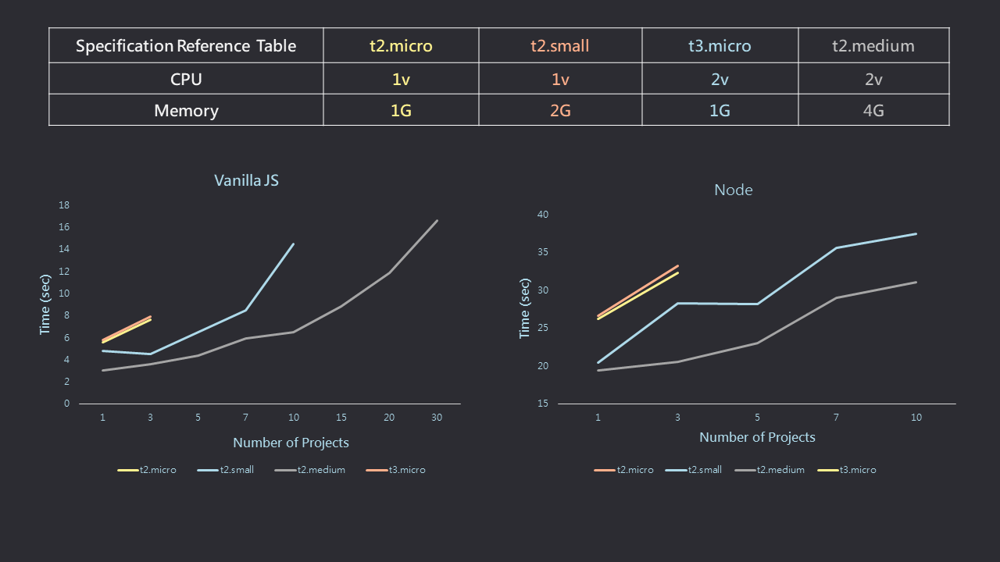

# Code3Wich

Website Link: [Code3Wich](https://code3wich.luhanwang.com/)

## Motivation

Initially, I aimed to create a real-time compiler for Unity's web platform. However, I soon realized that Unity's system is too heavy and challenging to run efficiently on a lightweight web environment. Still driven by my original goal of working on game-related projects, I pivoted to focusing on Three.js, a library that can also be used for game development.

While exploring Three.js, I realized that if I wanted to compile and execute JavaScript code, I might as well create a project that supports a complete development environment. Thus, Code3Wich was born!

## Tech / Framwork used

- Docker
- Socket.io
- AWS AmazonMQ (RabbitMQ)
- AWS RDS (MySQL)
- Vite + React
- TypeScript
- JavaScript

## Features

- **Static Web Hosting**: For projects using vanilla JavaScript, you can host and view your static web pages directly.

- **Dynamic Server Support**: For Node.js projects, you can host servers and interact with corresponding APIs to get return results.

- **Cross-Platform Compatibility**: Whether you're using a smartphone, iPad, or computer, you can compile code directly from our website.
- **Persistent and Shareable Projects**: Your compiled projects are preserved and can be accessed via a unique URL, allowing you to share your creations with friends and family.

- **Integrated Terminal Interface**:

  - Perform any operation through the terminal interface.
  - Download modules.
  - Create files and more through the terminal.

- **Real-Time Results Display**: Instantly see your web project results on the screen as you code.

## Architecture

## Stress Test

In Code3wich, after reviewing all functionalities, the bottleneck seems to occur when creating a project, as it involves creating a container. Therefore, this project specifically focuses on conducting a stress test for the project creation scenario.

### Goals

- Confirm the maximum number of projects that can be created simultaneously and the required time for each EC2 instance type.
- Implement safeguards for the maximum number of simultaneous project creations on a t2.micro instance to prevent the server from crashing due to too many concurrent project creations.

### Test Tool

[k6](https://k6.io/docs/)

### Result

### Conclusion

If a AWS EC2 **t2.micro** instance is used as the service instance machine, it can handle the creation of only three projects simultaneously, whether the project type is Vanilla JS or Node. Otherwise, the machine will crash.

However, upgrading to an AWS EC2 **t3.micro** instance, which has one more CPU than **t2.micro** instance, will have limited impact on addressing bottlenecks, and the effect may be quite similar to AWS EC2 **t2.micro** instance.

On the other hand, using an AWS EC2 **t2.small** instance, which has twice the memory of **t2.micro** instance, results in a significant improvement. This clearly indicates that the bottleneck in creating the project lies in memory rather than CPU.

Finally, testing the AWS EC2 **t2.large** instance shows that both its CPU and memory are significantly better than those of **t2.micro** instance. It clearly demonstrates that **t2.large** instance has the best performance.

### Solution

Set up an AWS Amazon MQ (RabbitMQ Broker) queue specifically for handling project creation tasks, and simultaneously launch 3 workers as consumers for this queue to meet the requirement of processing 3 tasks concurrently.

## Support me

